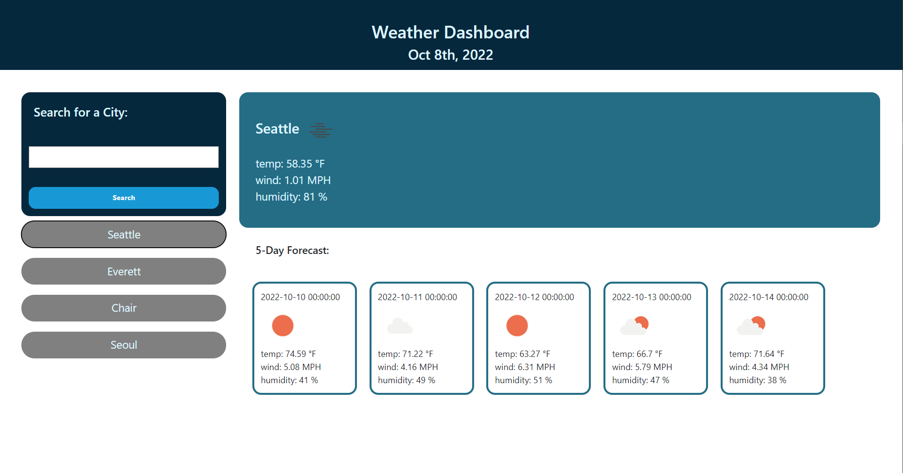

# weather-Dashboard

## Description 

I used weather API to create this website

It is working by the search if its an invalid link or wrong search it alarts the error

They also store the information into the local storage and generates the click bar on the left when you reload the page

With the icon link I also generated the icon to the weather list for the cuurent weather such as sunny cloudy 

In this icon I put the alt elements which is main on the weater API data which is describing the weather status

## User Story 

```
AS A traveler
I WANT to see the weather outlook for multiple cities
SO THAT I can plan a trip accordingly
```

## Acceptance Criteria

```
GIVEN a weather dashboard with form inputs
WHEN I search for a city
THEN I am presented with current and future conditions for that city and that city is added to the search history
WHEN I view current weather conditions for that city
THEN I am presented with the city name, the date, an icon representation of weather conditions, the temperature, the humidity, and the wind speed
WHEN I view future weather conditions for that city
THEN I am presented with a 5-day forecast that displays the date, an icon representation of weather conditions, the temperature, the wind speed, and the humidity
WHEN I click on a city in the search history
THEN I am again presented with current and future conditions for that city
```

## Langauges 

HTML, CSS, JavaScript

## Usage

You can search up the weather of the specific city in US and other countries 

They also save your search history in the localdata so you can easliy approach to the recent search

Not only the current weather of the city but also it shows 5 days of weather status of the city

## App Screenshot



## Live Website


https://miayun98.github.io/weather-Dashboard/

## Contact 

Linkedin: https://www.linkedin.com/in/sangmi-yun-0a4241201/